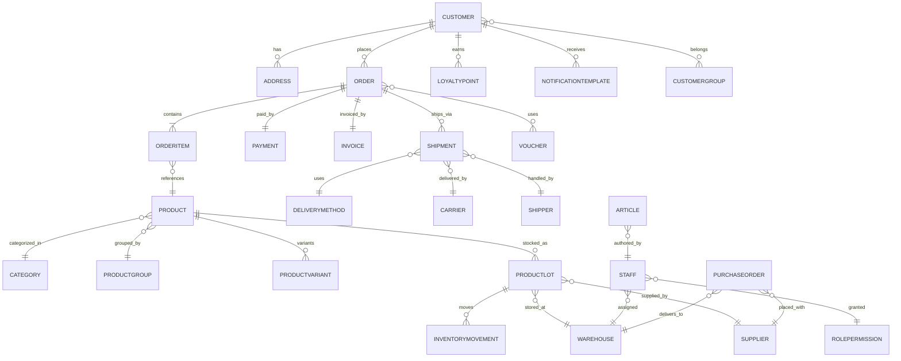

# Data Model

## Entities & Key Fields
- Customer (`id`, name, gender, phone, email, nationality, tier, region, totals, points_balance, group_ids). [Source: Phụ_Lục_01 r30 cDESCRIPTION][Source: Phụ_Lục_01 r212 cDESCRIPTION][Source: Phụ_Lục_01 r214 cDESCRIPTION]
- Address (`id`, customer_id, full_name, phone, address_text, is_default). [Source: Phụ_Lục_01 r37 cDESCRIPTION][Source: Phụ_Lục_01 r56 cDESCRIPTION]
- CustomerGroup (`id`, name, description, auto_rule). [Source: Phụ_Lục_01 r214 cDESCRIPTION]
- Voucher (`id`, code, type{discount|shipping}, value, percent_flag, min_order, max_order, start_at, end_at, usage_limits, scope_categories/products/groups). [Source: Phụ_Lục_01 r38 cDESCRIPTION][Source: Phụ_Lục_01 r228 cDESCRIPTION][Source: Phụ_Lục_01 r229 cDESCRIPTION]
- LoyaltyPoint (`id`, customer_id, earned, redeemed, conversion_rules). [Source: Phụ_Lục_01 r39 cDESCRIPTION][Source: Phụ_Lục_01 r230 cDESCRIPTION]
- Category (`id`, name, parent_id). [Source: Phụ_Lục_01 r44 cDESCRIPTION]
- ProductGroup (`id`, category_id, name, attributes). [Source: Phụ_Lục_01 r45 cDESCRIPTION]
- Product (`id`, category_id, group_ids, sku, name, description, media, base_price, sell_price, rating, sell_by_date, expire_date). [Source: Phụ_Lục_01 r166 cDESCRIPTION][Source: Phụ_Lục_01 r47 cDESCRIPTION]
- ProductVariant (`id`, product_id, attributes, price, stock_status). [Source: Phụ_Lục_01 r47 cDESCRIPTION]
- ProductLot (`id`, product_id, supplier_id, warehouse_id, lot_code, cost_price, qty_received, qty_onhand, location_code, expire_date). [Source: Phụ_Lục_01 r169 cDESCRIPTION][Source: Phụ_Lục_01 r184 cDESCRIPTION]
- Warehouse (`id`, name, address, owner_contact, phone). [Source: Phụ_Lục_01 r182 cDESCRIPTION]
- InventoryMovement (`id`, lot_id, type{import|export|return|quarantine}, qty, reason, created_by). [Source: Phụ_Lục_01 r183 cDESCRIPTION]
- Order (`id`, customer_id, status_customer, status_internal, payment_method, shipping_method_id, carrier_id, shipping_fee, shipping_discount, voucher_ids, note, total_products, total_payable). [Source: Phụ_Lục_01 r33 cDESCRIPTION][Source: Phụ_Lục_01 r175 cDESCRIPTION][Source: Phụ_Lục_01 r176 cDESCRIPTION]
- OrderItem (`id`, order_id, product_id, variant_id, quantity, unit_price, line_total). [Source: Phụ_Lục_01 r33 cDESCRIPTION][Source: Phụ_Lục_01 r58 cDESCRIPTION]
- Shipment (`id`, order_id, carrier_id, delivery_method_id, tracking_code, eta, status, cod_amount, shipper_id). [Source: Phụ_Lục_01 r57 cDESCRIPTION][Source: Phụ_Lục_01 r177 cITEM][Source: Phụ_Lục_01 r204 cDESCRIPTION]
- DeliveryMethod (`id`, name, carrier_options). [Source: Phụ_Lục_01 r199 cDESCRIPTION]
- Carrier (`id`, name, active_flag, cod_methods). [Source: Phụ_Lục_01 r198 cITEM][Source: Phụ_Lục_01 r201 cDESCRIPTION]
- Payment (`id`, order_id, method{COD|Payoo}, amount, status, transaction_ref). [Source: Phụ_Lục_01 r63 cDESCRIPTION][Source: Phụ_Lục_01 r239 cDESCRIPTION]
- Invoice (`id`, order_id, tax_info, scheduled_send_at, status). [Source: Phụ_Lục_01 r61 cDESCRIPTION][Source: Phụ_Lục_01 r179 cDESCRIPTION]
- Staff (`id`, group_id, name, gender, phone, email, address). [Source: Phụ_Lục_01 r207 cITEM][Source: Phụ_Lục_01 r210 cDESCRIPTION]
- RolePermission (`id`, role_id, module, actions). [Source: Phụ_Lục_01 r209 cDESCRIPTION]
- Shipper (`id`, name, phone, email, status, credentials). [Source: Phụ_Lục_01 r203 cDESCRIPTION]
- ShipperAssignment (`id`, shipper_id, shipment_id, pickup_status, delivered_status, reassigned_by). [Source: Phụ_Lục_01 r204 cDESCRIPTION]
- Supplier (`id`, name, contact_name, phone, email, address, bank_account). [Source: Phụ_Lục_01 r188 cDESCRIPTION]
- PurchaseOrder (`id`, supplier_id, warehouse_id, status, products, quantities, prices, delivery_deadline). [Source: Phụ_Lục_01 r189 cDESCRIPTION][Source: Phụ_Lục_01 r234 cDESCRIPTION]
- NotificationTemplate (`id`, audience_type, channel, content). [Source: Phụ_Lục_01 r216 cDESCRIPTION][Source: Phụ_Lục_01 r217 cDESCRIPTION]
- Article (`id`, category_id, tags, title, body, blocks). [Source: Phụ_Lục_01 r222 cITEM][Source: Phụ_Lục_01 r220 cITEM]
- StaticPage (`id`, title, body, status). [Source: Phụ_Lục_01 r224 cITEM]

## Relationships (ER)

