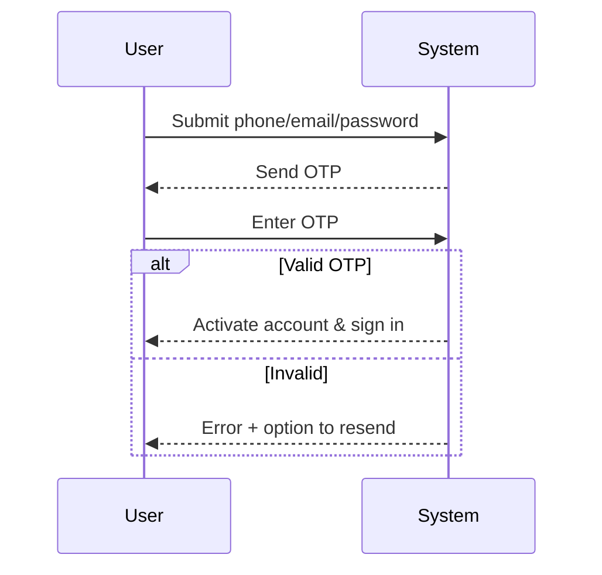
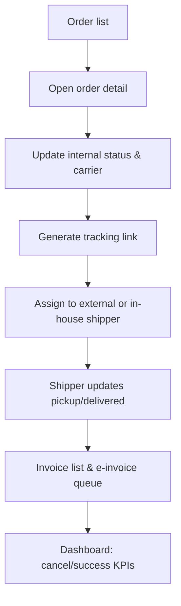

# User Flows

## Buyer Checkout (Web/App)
Steps:
1) Customer adds products to cart, adjusts quantity/variants. [Source: Phụ_Lục_01 r50 cDESCRIPTION][Source: Phụ_Lục_01 r51 cDESCRIPTION]
2) Customer applies voucher(s) and proceeds to checkout with selected items. [Source: Phụ_Lục_01 r53 cDESCRIPTION][Source: Phụ_Lục_01 r54 cDESCRIPTION]
3) Customer selects/creates delivery address. [Source: Phụ_Lục_01 r56 cDESCRIPTION][Source: Phụ_Lục_01 r37 cDESCRIPTION]
4) Customer chooses delivery method/carrier; system returns ETA and fee. [Source: Phụ_Lục_01 r57 cDESCRIPTION]
5) Customer reviews order summary, applies voucher per type, and sees total calculation. [Source: Phụ_Lục_01 r58 cDESCRIPTION][Source: Phụ_Lục_01 r60 cDESCRIPTION]
6) Customer enters invoice info (optional), note, and selects payment (COD/Payoo). Order is created only on success. [Source: Phụ_Lục_01 r61 cDESCRIPTION][Source: Phụ_Lục_01 r62 cDESCRIPTION][Source: Phụ_Lục_01 r63 cDESCRIPTION]
7) System sends order email to customer and warehouse. [Source: Phụ_Lục_01 r64 cDESCRIPTION]

```mermaid
flowchart TD
  A[Browse & add to cart] --> B[Adjust qty/variant]
  B --> C[Apply voucher(s)]
  C --> D[Select/ add address]
  D --> E[Choose delivery method/carrier -> ETA/Fee]
  E --> F[Review summary & totals]
  F --> G[Enter invoice note]
  G --> H[Pay via COD/Payoo]
  H --> I{Payment success?}
  I -->|Yes| J[Create order status=Đang xử lý]
  I -->|No| C
  J --> K[Send emails to customer & warehouse]
```

## Buyer Registration with OTP
Steps:
1) Customer enters phone/email/password to create account. [Source: Phụ_Lục_01 r21 cDESCRIPTION]
2) System sends OTP (SMS/email) for verification. [Source: Phụ_Lục_01 r22 cITEM]
3) Customer submits OTP; system validates.
4) On success, account activated and login session started. [Source: Phụ_Lục_01 r19 cDESCRIPTION]
5) If OTP invalid/expired, show error and allow resend. [Source: Phụ_Lục_01 r20 cDESCRIPTION]



## Admin Order Fulfillment & Carrier Assignment
Steps:
1) Admin views order list with filters and KPIs. [Source: Phụ_Lục_01 r174 cDESCRIPTION]
2) Admin opens order detail to review payment, items, fees. [Source: Phụ_Lục_01 r175 cDESCRIPTION]
3) Admin verifies status mapping and selects/updates carrier before pickup if needed. [Source: Phụ_Lục_01 r176 cDESCRIPTION][Source: Phụ_Lục_01 r178 cDESCRIPTION]
4) Admin triggers shipment link lookup for carrier tracking. [Source: Phụ_Lục_01 r177 cITEM]
5) Admin issues invoice entry and schedules e-invoice if required. [Source: Phụ_Lục_01 r179 cDESCRIPTION]
6) Admin monitors status dashboards for cancellations/success/returns. [Source: Phụ_Lục_01 r180 cDESCRIPTION]
7) For in-house carrier, admin assigns orders to shipper and shipper updates pickup/delivery. [Source: Phụ_Lục_01 r204 cDESCRIPTION][Source: Task Breakdown r29 cC]


